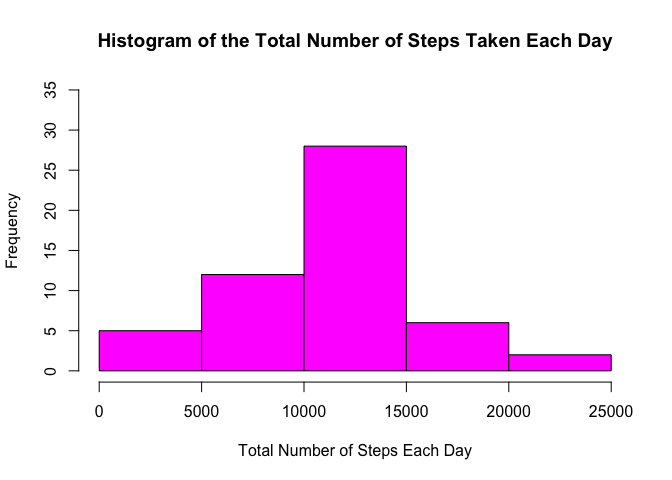
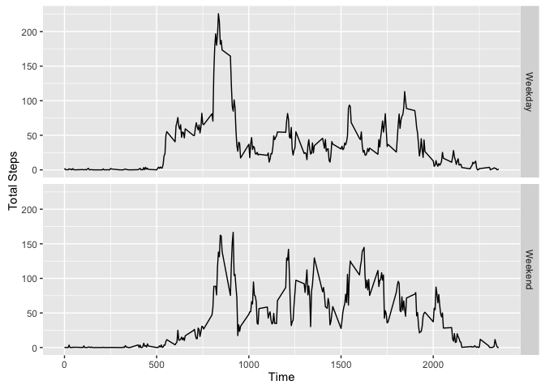

# Reproducible Research: Peer Assessment 1

##Introduction

It is now possible to collect a large amount of data about personal movement using activity monitoring devices such as a Fitbit, Nike Fuelband, or Jawbone Up. These type of devices are part of the "quantified self" movement -- a group of enthusiasts who take measurements about themselves regularly to improve their health, to find patterns in their behavior, or because they are tech geeks. But these data remain under-utilized both because the raw data are hard to obtain and there is a lack of statistical methods and software for processing and interpreting the data.

This assignment makes use of data from a personal activity monitoring device. This device collects data at 5 minute intervals through out the day. The data consists of two months of data from an anonymous individual collected during the months of October and November, 2012 and include the number of steps taken in 5 minute intervals each day.

##Data

he data for this assignment was downloaded from the course web site:

Dataset: [Activity monitoring data](https://d396qusza40orc.cloudfront.net/repdata%2Fdata%2Factivity.zip)

The variables included in this dataset are:

  1. steps: Number of steps taking in a 5-minute interval (missing values are coded as NA)

  2. date: The date on which the measurement was taken in YYYY-MM-DD format

  3. interval: Identifier for the 5-minute interval in which measurement was taken

The dataset is stored in a comma-separated-value (CSV) file and there are a total of 17,568 observations in this dataset.

##Assignment

###Loading and preprocessing the data

The following code checks for the data file in the working directory. If it does not find, it downloads the zipfile of the data, unzips it and saves the dataset under the name of "activity"


```r
if(!file.exists("getdata-projectfiles-UCI HAR Dataset.zip")){
        temp <- tempfile()
        download.file("http://d396qusza40orc.cloudfront.net/repdata%2Fdata%2Factivity.zip",temp)
        unzip(temp)
        unlink(temp)
}
activity <- read.csv("activity.csv")
```

###What is mean total number of steps taken per day?

Total number of steps taken per day can be calculated with the following code.


```r
#Converting the date variable into class "Date"
activity$date <- as.Date(activity$date)

#Finding the total number of steps each day
total.steps <- with(activity, tapply(steps, date, sum))
```


Total number of steps taken per day can be plotted in the histogram with the following code


```r
#Plotting the histogram using the above dataset
hist(total.steps, ylim = c(0,35), xlab = "Total Number of Steps Each Day", 
     ylab = "Frequency", main = "Histogram of the Total Number of Steps Taken Each Day", col = 
             "Magenta") 
```

<!-- -->

The mean and median of the total number of steps can be found.


```r
mean.steps <- mean(total.steps, na.rm = TRUE)

median.steps <- median(total.steps, na.rm = TRUE)
```

```r
mean.steps
```

```
## [1] 10766.19
```

```r
median.steps
```

```
## [1] 10765
```


### What is the average daily activity pattern?


```r
#Averaging the steps based on time of the day over the period of two months
interval.mean <- aggregate(steps~interval, activity, mean)

#Using ggplot2 package to plot the results
library(ggplot2)

g <- ggplot(interval.mean, aes(interval, steps))
p <- g + geom_line() + xlab("Time") + ylab("Total Steps") + ggtitle("Average number of steps taken throughout the day")
print(p)
```

<!-- -->

The 5-minute interval, on average across all the days in the dataset, which contains the maximum number of step can be found by the following code.


```r
max.interval <- interval.mean[which.max(interval.mean$steps),1]
```

```r
max.interval
```

```
## [1] 835
```

```r
max.interval
```

```
## [1] 835
```

08:35 is the time interval at which max steps were taken.

###Imputing missing values

There are 2304 missing values in the dataset which was found by the following.


```r
missing.values <- sum(is.na(activity))
```

The missing values were replaced by the mean value of the steps taken in that interval, averaged across all days. The new dataset is stored under imputed.activity.


```r
##interval.mean, caluculated in the previous section, contains the mean values needed to replace the missing values
imputed.activity <- transform(activity, steps = ifelse(is.na(activity$steps), interval.mean$steps[match(activity$interval, interval.mean$interval)], activity$steps))
```

Since no data was collected for the first day, all the NA of "2012-10-01" have to replaced by 0 to prevent any unccessary deviations from the result.


```r
imputed.activity[as.character(imputed.activity$date) == "2012-10-01", 1] <- 0
```

The dataset with the missing values(activity) and imputed one (imputed.activity) are superimposed on each other


```r
imp.total.steps <- with(imputed.activity, tapply(steps, date, sum))

# The imputed.activity dataset is plotted
hist(imp.total.steps, ylim = c(0,35), xlab = "Total Number of Steps Each Day", ylab = "Frequency", main = "Histogram of the Total Number of Steps Taken Each Day", col = "Green")

# The actvity dataset (with the missing values) is plotted over the imputed.activity
hist(total.steps, ylim = c(0,35), xlab = "Total Number of Steps Each Day", ylab = "Frequency", col = "Magenta", add=TRUE)

legend("topright", c("Imputed", "Non-imputed"), col=c("Green", "Magenta"), lwd=6)
```

<!-- -->

The mean and the median for the imputed dataset is as follows.


```r
i.mean.steps <- mean(imp.total.steps)
i.median.steps <- median(imp.total.steps)
```

```r
i.mean.steps
```

```
## [1] 10589.69
```

```r
i.median.steps
```

```
## [1] 10766.19
```

Calculating the difference between the activity and imputed.activity datasets.


```r
##Difference between the means
mean.diff <- i.mean.steps - mean.steps

##Difference between the medians
median.diff <- i.median.steps - median.steps

##Difference between the total number of steps
total.diff <- sum(imputed.activity$steps) - sum(activity$steps, na.rm = T) 
```

```r
mean.diff
```

```
## [1] -176.4949
```

```r
median.diff
```

```
## [1] 1.188679
```

```r
total.diff
```

```
## [1] 75363.32
```

It is observed that the mean decreases by 176.5 steps while the median is increased by 1.2. Also, the total steps have increased by 75363.

###Are there differences in activity patterns between weekdays and weekends?

Creating a new factor variable in the dataset with two levels – “weekday” and “weekend” indicating whether a given date is a weekday or weekend day.


```r
#Using the the weekdaysfunction to convert all the dates into Weekdays and storing the dataset under week.activity
week.activity = transform(imputed.activity, date = weekdays(activity$date, abbreviate = FALSE))

#Replacing all the weekdays with factor "Weekday" and weekends with "Weekend"
week.activity$date <- gsub("Monday|Tuesday|Wednesday|Thursday|Friday", "Weekday", week.activity$date)
week.activity$date <- gsub("Saturday|Sunday", "Weekend", week.activity$date)
week.activity$date <- as.factor(week.activity$date)
```

Making a panel plot with ggplot 2 package containing a time series plot of the 5-minute interval and the average number of steps taken, averaged across all weekday days or weekend days.


```r
#Filtering the mean steps over 5 min interval, separated by Weekday and Weekend factor variables
week.mean.steps <- aggregate(steps~interval+date, week.activity, mean)

p1 <- ggplot(week.mean.steps, aes(interval, steps)) + facet_grid(date~.) + geom_line()  + xlab("Time") + ylab("Total Steps")
print(p1)
```

<!-- -->


